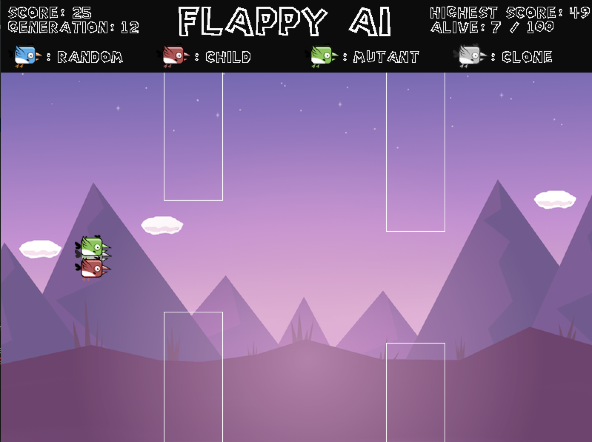

# Flappy AI

***

FlappyAI is a project that utilizes neural networks and genetic algorithms to teach an AI to learn to play the popular game Flappy Bird at a super human level. Flappy bird is a popular game for the AI community that has been tackled using reinforcement Q learning, deep neural networks, and more. I decided to try to make my own version of this problem as a fun project to learn more about genetic algorithms and neural networks.



***


## Introduction


#### Objective
Flappy Bird is a game with a simple objective: Get your bird as far as you can without touching the rectangular obstacles or the ground. As soon as the bird collides with one of the rectangles, the game ends. The score of the flappy bird is equal to how many rectangle obstacles the bird has successfully avoided. So a score of 32 means the bird has passed 32 obstacles.

#### Controls

There are only two possible moves that a flappy bird can make. 
<ol>
<li>Jump (generally by tapping a phone screen or clicking a computer mouse)
<li>Do nothing
</ol>The sparsity of controls in Flappy Bird makes it a great game to introduce AI algorithms, the simplicity of the game allows AI algorithms to work without massive space time computation resources. 

#### Simulation

In Flappy AI I have created a simulation of the Flappy Bird, where 100 birds are spawned every round. These birds are not user controlled, but controlled by the computer. They operate under the same mechanics as a player would if he or she was controlling the bird. They can only see what is on the screen and can only choose to jump or do nothing. Once all the birds die off, a new round starts with new modified birds created by AI algorithms. However, the highest scoring bird's score is saved.

***

## Neural Network

#### Neural Network Introduction
A Neural Network is a function approximator that consists of artificial 'neurons' that are linked together in a network. Through simple mathematical operations, the network maps an arbitrary number of inputs to an arbitrary number of outputs. Using various machine learning  algorithms, The weight and bias values of a neural network are fine tuned to learn the approximate function that will most accurately transform the inputs of the training data to their corresponding outputs.


#### Implementation
Each different bird in this simulation has its own 'brain' or neural network. The neural network in each bird decides what actions the bird takes in certain situations. The architecture for the neural network is shown below:


Each bird's neural network gets 4 inputs:
<ol>
    <li>Horizonal distance from bird to next obstacle
    <li>Vertical distance from bird to next obstacle
    <li>Verical Distance from bird to ground
    <li>Velocity of bird falling
</ol>
These four inputs are fed through the neural network and the output value is recorded. If the output value > 0.5, the bird will jump. Else if the output value <= 0.5, the bird will do nothing. This process is repeated every single game frame. This means that each bird is taking its input information into consideration and calculating whether or not to jump multiple times a second.

***

## Genetic Algorithm

Ultimately, the weights and biases of the neural network decide how each Flappy Bird will respond in certain situations. If all the weights are random, then the bird will most likely jump at random times that are not neccessary and perform horribly in the game. The weights have to somehow be fine tuned in order to make the bird jump when it needs to and do nothing when it shouldn't in order to achieve the highest score possible. So how can we fine tune these weights automatically without adjusting them manually?  

#### Fitness Function

First, we must have some way to objectively define how well a certain bird performs. We need to be able to measure and put a number on how 'fit' a certain bird's weights and biases are. This is a done by a fitness function. It measures how good a bird performs. We know that birds that score higher on the fitness function have weights and biases that are closer to the optimal bird that performs perfecly. Overtime, we want to adjust our neural networks so that they result in the birds scoring higher on the fitness function.

<B>For this problem, a fitness function can be easily defined as the distance the bird has travelled</B>. This means that birds that make it farther have a higher fitness than birds that fail and collide with an object earlier in the round.


#### Tuning the Weights 

There are various algorithms to tune the weights of a Neural Network. Some popular ones are Error Backpropogation, Hebbian Learning, and Genetic Algorithms. For this problem, we are using a Genetic Algorithm. <B>Genetic Algorithms are an artificial simulation of Biological reproduction, selection, and mutation. </B> 

<ul>
    <li>Reproduction/Selection: A certain amount of weights from one birds network are combined with the weights of a different birds network. This simulates two birds having a child. <B>Birds with higher fitness scores are more likely to reproduce.</B> This simulates Biological Selection.</li>
    <li>Mutation: There is a chance of birds from the previous population to have random changes to their weights. This simulates DNA mutation and allows for the introduction of new 'genetic information' to the population.</li>
</ul>
    


These two mechanisms allow the population of birds to slowly adapt their neural networks to maximize the fitness function. Initially, the bird's network weights are randomly set. Then, using selection and mutation, the networks slowly maximize the fitness function, which makes the birds perform better and better as the generations pass.

#### The Algorithm

Initially, 100 birds are spawned with randomly set weights. Then after all the birds have died, a new generation is made from the previous generation using this algorithm:
<ol>
    <li>Five clones of the highest scoring bird are made.</li>
    <li>One clone of each bird ranked 2-15 are made.</li>
    <li>Multiple children from the top 10 are made.</li>
    <li>Multiple children from the top 50 are made.</li>
    <li>Multiple children from rest of the population are made. One parent must be
    in the top 50.</li>
</ol>


Overtime, this algorithm causes the population to increase its overall fitness score. Since it is based largely on random chance, the fitness score does not always go up, but can decrease for a period of time before increasing again. Below is a graph showing the average fitness score of all the birds in each generation for 30 generations:


Although the fitness score doesn't increase every individual generation, there is a very large increase over multiple generations and longer periods of time.


***

## Run the Simulation

A short video of a FlappyAI simulation run can be viewed via Youtube:

<a href = "https://www.youtube.com/watch?v=xwtjWiSg984"> </a>

#### Tools Used

<ul>
    <li> <B>Python 3.6:</B> Flappy AI was written using Python 3.6 </li>
    <li> <B>Pygame:</B> The simulation and graphics were written using the pygame library that can be easily installed using pip.
        
</ul>
There were no third party tools used for the programming of the neural network or genetic algorithm.

#### Steps to Run
<ol>
    <li>git clone the repository</li>
    <li>install python if not already installed</li>
    <li>install pygame if not already installed, can use command: "pip install pygame"</li>
    <li>navigate to FlappyAI directory</li>
    <li>run simulation with command "python Main.py"</li>

</ol>


```python

```
